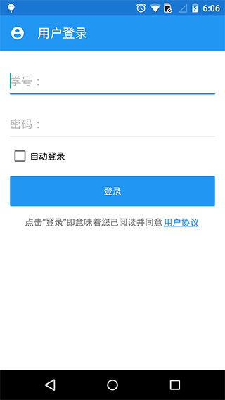
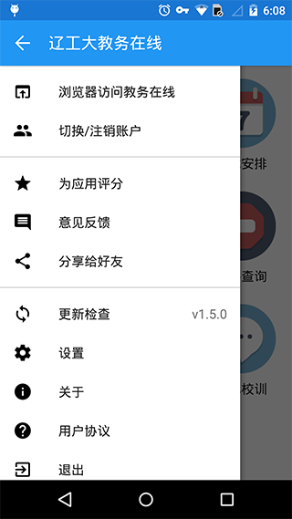
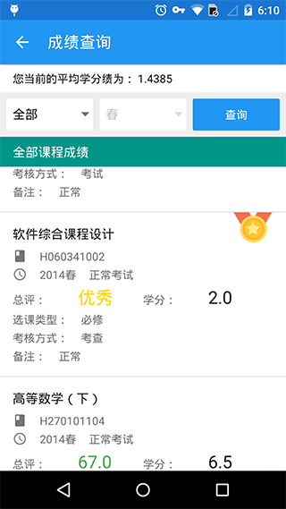
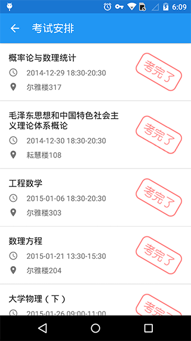
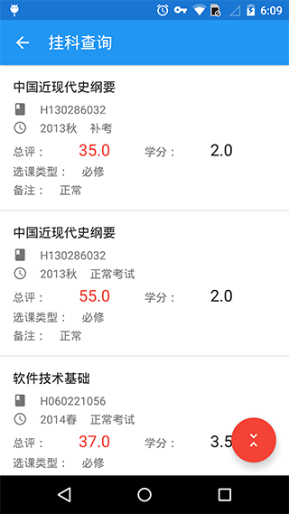

# DEPRECATED #

项目已经停止维护。今后基于此代码衍生的任何版本，包不包含恶意程式，请用户自行鉴别。

今后如有任何人，或者任何组织，想要使用此代码衍生新的发行版本，请遵守 AGPL-3.0 的 License。并且在显眼地方注明衍生版字样。

除此之外，不允许作为毕设，课设，软件大赛，等等。

本组织保留一切解释权。

---

该项目即将停止维护和提供服务。

请使用 **[辽宁工程技术大学官方教务在线](http://60.18.131.131)** 提供的服务。

感谢支持！！

# 辽工大教务在线-Android客户端 #

v2，Material Design 风格

官方网站：[http://online.lntu.org](http://online.lntu.org)

服务端项目：[LNTUOnline-API](https://github.com/LNTUORG/LNTUOnline-API)

iOS客户端：[LNTUOnline-iOS](https://github.com/LNTUORG/LNTUOnline-iOS)

## Downloads ##

- [Google Play](https://play.google.com/store/apps/details?id=com.lntu.online)

- [FIR.im](http://fir.im/LntuOnline)

- [360手机助手](http://zhushou.360.cn/detail/index/soft_id/1964733?recrefer=SE_D_%E8%BE%BD%E5%B7%A5%E5%A4%A7%E6%95%99%E5%8A%A1%E5%9C%A8%E7%BA%BF)

- [腾讯应用宝](http://android.myapp.com/myapp/detail.htm?apkName=com.lntu.online)

- [魅族Flyme应用中心](http://app.meizu.com/apps/public/detail?package_name=com.lntu.online)

- [小米应用商店](http://app.mi.com/detail/81673)

- [豌豆荚](http://www.wandoujia.com/apps/com.lntu.online)

- [安智市场](http://www.anzhi.com/soft_1863172.html)

- [木蚂蚁应用市场](http://www.mumayi.com/android-851065.html?1412616355)

## Screenshots ##

 

 

 

 

## Dependencies ##

- [Butter Knife](https://github.com/JakeWharton/butterknife)

- [OkHttp](http://square.github.io/okhttp)

- [Retrofit](http://square.github.io/retrofit)

- [Picasso](http://square.github.io/picasso)

- [Gson](https://github.com/google/gson)

- [Joda-Time](http://www.joda.org/joda-time)

- [Joda-Time-Android](https://github.com/dlew/joda-time-android)

- [MaterialEditText](https://github.com/rengwuxian/MaterialEditText)

- [NineOldAndroids](http://nineoldandroids.com)

- [FloatingActionButton](https://github.com/makovkastar/FloatingActionButton)

- [material-design-icons](https://github.com/google/material-design-icons)

- [Shape Image View](https://github.com/siyamed/android-shape-imageview)

## Thanks ##

- [《印象·工大》葫芦岛校区掠影作品集](http://tieba.baidu.com/p/1424591498)

## Author ##

TakWolf

[takwolf@foxmail.com](mailto:takwolf@foxmail.com)

[http://takwolf.com](http://takwolf.com)

## License ([AGPL-3.0](https://opensource.org/licenses/AGPL-3.0)) ##

    Copyright (C) 2015-2017 LNTU.ORG (http://lntu.org)
    Copyright (C) 2014-2017 TakWolf <takwolf@foxmail.com>
    
    This program is free software: you can redistribute it and/or modify
    it under the terms of the GNU Affero General Public License as published by
    the Free Software Foundation, either version 3 of the License, or
    (at your option) any later version.

    This program is distributed in the hope that it will be useful,
    but WITHOUT ANY WARRANTY; without even the implied warranty of
    MERCHANTABILITY or FITNESS FOR A PARTICULAR PURPOSE.  See the
    GNU Affero General Public License for more details.

    You should have received a copy of the GNU Affero General Public License
    along with this program.  If not, see <http://www.gnu.org/licenses/>.
